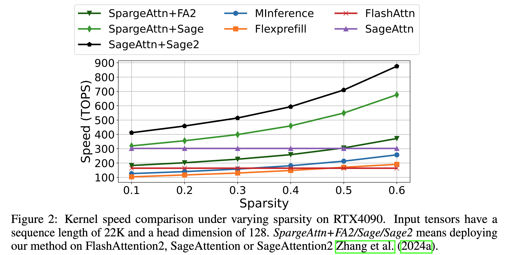
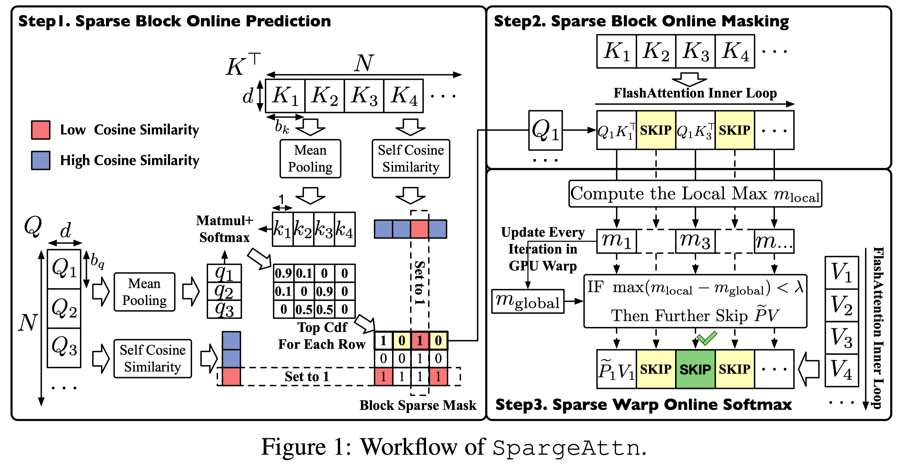
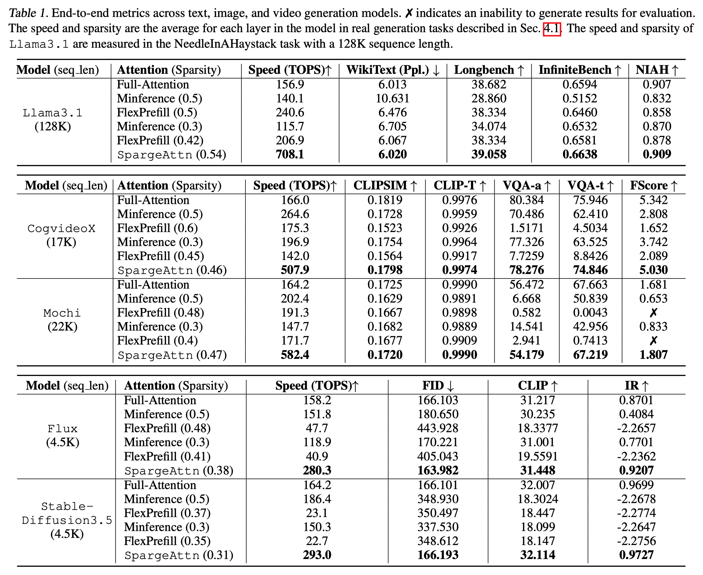

# SpargeAttention
The official implementation of [SpargeAttn](https://arxiv.org/abs/2502.18137), a universal training-free sparse attention accelerating language, image, and video models.

<div align="center"> <h2>SpargeAttention: Accurate and Training-free Sparse Attention<br>Accelerating Any Model Inference</h2> <a href="https://huggingface.co/papers/2502.18137">  </a> <a href="https://arxiv.org/abs/2502.18137">  </a> </div> 

<div align="center">
    <a href="https://jt-zhang.github.io/" target="_blank">Jintao Zhang</a><sup></sup> | 
    <a href="https://xiang-cd.github.io/cv" target="_blank">Chendong Xiang</a><sup></sup> | 
    <a href="https://github.com/jason-huang03" target="_blank">Haofeng Huang</a><sup></sup> | 
    <a href="https://haochengxi.github.io/" target="_blank">Haocheng Xi</a><sup></sup> |
    <a href="" target="_blank">Jia Wei</a><sup></sup> | 
    <a href="https://ml.cs.tsinghua.edu.cn/~jun/index.shtml" target="_blank">Jun Zhu</a><sup></sup> |
    <a href="https://ml.cs.tsinghua.edu.cn/~jianfei" target="_blank">Jianfei Chen</a><sup></sup>
</div>

<!-- Jintao Zhang, Chendong Xiang, Haofeng Huang, Haocheng Xi, Jia Wei, Jun Zhu, Jianfei Chen -->

<br>

<p align="center">

</p>

<p align="center">

</p>

## Project Updates
- [Sparse SageAttention1 API](https://github.com/jt-zhang/Sparse_SageAttention_API) and [Sparse SageAttention2 API](#usage-examples) can compute attention with any block sparse pattern very fast.
- SpargeAttn based on [SageAttention2++](https://arxiv.org/abs/2505.21136) will be released around June 25.
- [2025-05-11]: Add a **very simple usage without tuning or calibration**: `o = spas_sage2_attn_meansim_cuda(q, k, v)`.
- [2025-05-02]: 🎉SpargeAttn and [SageAttention2](https://github.com/thu-ml/SageAttention) are accepted by ICML 2025!
- [2025-01-24]: 🎉[SageAttention](https://github.com/thu-ml/SageAttention) is accepted by ICLR 2025! 

## Installation
### Base environment
+ `python>=3.9`   , `torch>=2.3.0`
- `CUDA`:
  + `>=12.8` for Blackwell, `>=12.4` for fp8 support on Ada, `>=12.3` for fp8 support on Hopper, `>=12.0` for Ampere


### Install Package

```bash
pip install ninja   # for parallel compilation
python setup.py install   # or pip install -e .
```


## Avalible API
- `spas_sage2_attn_meansim_cuda`: SpargeAttn based on [SageAttention2](https://github.com/thu-ml/SageAttention).

- `spas_sage_attn_meansim_cuda`: SpargeAttn based on [SageAttention](https://github.com/thu-ml/SageAttention).


## Usage Examples
### A Simple Usage Without Tuning for Any Model
```python
from spas_sage_attn import spas_sage2_attn_meansim_cuda

attn_output = spas_sage2_attn_meansim_cuda(q, k, v, simthreshd1=0.6, cdfthreshd=0.97, pvthreshd=15, is_causal=False)
```

You can tune `simthreshd1` and `cdfthreshd` to balance between attention accuracy (higher values) and sparsity (lower values). **However, for optimal accuracy and sparsity performance, we recommend running a tuning process before inference, as described below.**  

### Sparge+SageAttention2++ with Any Block-Sparse Pattern

```python
from spas_sage_attn import block_sparse_sage2_attn_cuda

block_sparse_sage2_attn_cuda(q, k, v, mask_id=None, scale=None, pvthreshd=20, attention_sink=False, tensor_layout="HND", return_sparsity=False):
```

In this API, we support computing $S=QK^T$ in any block sparse pattern per attention head. And we compute $PV$ multiplication with further acceleration. Specifically, the attention mask per head, `mask_id`, is of shape `(batch_size, num_qo_heads, qo_seq_len // BLOCK_M, kv_seq_len // BLOCK_N)`. Currently, the supported block size is aligned to that of SpargeAttention, which is (BLOCK_M = 128, BLOCK_N = 64). The lower `pvthreshd`, the more sparsity for `PV` Matmul and faster attention.


### CogVideoX

Tuning:  
```bash
# sequential tuning
python evaluate/cogvideo_example.py  --use_spas_sage_attn --model_out_path evaluate/models_dict/CogVideoX-2b_0.06_0.07.pt --tune

# parallel tuning, this will use all gpu available on the machine 
python evaluate/cogvideo_example.py  --use_spas_sage_attn --model_out_path evaluate/models_dict/CogVideoX-2b_0.06_0.07.pt --tune --parallel_tune
```

Inference:  
```bash
# `--compile` is optional and will slow the first time inference.
python evaluate/cogvideo_example.py  --use_spas_sage_attn --model_out_path evaluate/models_dict/CogVideoX-2b_0.06_0.07.pt --compile
```

> **Note:**
We provide pre-tuned hyper-parameters `CogVideoX-2b_0.06_0.07.pt` that allow running the inference script directly. However, for better performance in both speed and quality, we recommend re-tuning because the provided hyper-parameters are tuned with SpargeAttn based on SageAttention, whereas the default API is based on SageAttention2 now.

> **Note:**
`--compile` is optional and will further accelerate video generation but bring an overhead for the first video generation.

### LLama
The tuning and inference usage is similar to CogVideoX.

### Supported models
Here’s a list of the tuned models so far, go to [hugginface](https://huggingface.co/Xiang-cd/sparge-attention-model-zoo) to see all tuned ckpt. 
Our approach is universal, and we warmly welcome contributions! Feel free to submit a pull request to support more models. 🚀

| model name | example script | tuned ckpt |
| ---- | ---- | ---- |
| CogVideoX-2b | evaluate/cogvideo_example.py | [link](https://huggingface.co/Xiang-cd/sparge-attention-model-zoo/blob/main/cogvideox-2b/CogVideoX-2b_0.06_0.07.pt)
| want2v-1.3B  | evaluate/wan_example.py | [link](https://huggingface.co/Xiang-cd/sparge-attention-model-zoo/tree/main/want2v-1.3B)
| Flux  | evaluate/flux_example.py  | TBD 


## Performance

> **Note:** All experiments in the above Table and our paper used SpargeAttn based on SageAttention. An updated implementation based on SageAttention2, is available now. **It further offers a 30% speedup.**
<br>


<table>
  <tr>
    <td align="center">
      
      <br>
      The quality of video generation on Mochi.
    </td>
    <td align="center">
      
      <br>
      End-to-end performance of NIAH.
    </td>
  </tr>
</table>


<!--  -->


## Citation
**If you use this code or find our work valuable, please cite:**
```
@inproceedings{zhang2025spargeattn,
  title={Spargeattn: Accurate sparse attention accelerating any model inference},
  author={Zhang, Jintao and Xiang, Chendong and Huang, Haofeng and Wei, Jia and Xi, Haocheng and Zhu, Jun and Chen, Jianfei},
  booktitle={International Conference on Machine Learning (ICML)},
  year={2025}
}

@inproceedings{zhang2025sageattention,
  title={SageAttention: Accurate 8-Bit Attention for Plug-and-play Inference Acceleration}, 
  author={Zhang, Jintao and Wei, Jia and Zhang, Pengle and Zhu, Jun and Chen, Jianfei},
  booktitle={International Conference on Learning Representations (ICLR)},
  year={2025}
}

@inproceedings{zhang2024sageattention2,
  title={Sageattention2: Efficient attention with thorough outlier smoothing and per-thread int4 quantization},
  author={Zhang, Jintao and Huang, Haofeng and Zhang, Pengle and Wei, Jia and Zhu, Jun and Chen, Jianfei},
  booktitle={International Conference on Machine Learning (ICML)},
  year={2025}
}
```
